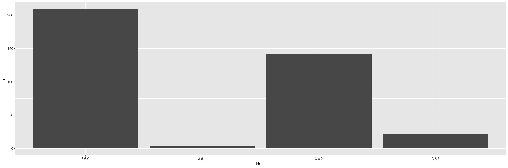

<!-- README.md is generated from README.Rmd. Please edit that file -->

# packages-report

## Bonus activity prompt

  - Combine your work analyzing your R packages and what we’ve learned
    re: GitHub and R Markdown
  - This `README.Rmd` gives a scaffold for using the work you did
    earlier to make a little report.
  - Given our previous work, I’m using pre-computed results and
    including a pre-made figure, leaving the R code down in scripts
    below `R/`. But know that, in other contexts, you could inline all
    that code in chunks here. Depends on downstream usage and the
    project context.
  - Locally, do `README.Rmd` –\> `README.md` with the “Knit” button or
    via `rmarkdown::render("README.Rmd")`. Commit both.
  - I presume you are hooked up to GitHub remote repo, covered in
    [Existing project, GitHub
    last](https://happygitwithr.com/existing-github-last.html). Summary:
      - Consider the convenience function `usethis::use_github()`. Or to
        do by hand:
      - Create a similarly-named repo on GitHub.
      - Add it to the local repo as the `origin` remote: `git remote add
        origin https://github.com/YOU/REPO.git`.
      - Push and cement the branch tracking relationship: `git push
        --set-upstream origin master`.
  - Push\! Now your README is an excellent welcome mat and summary of
    your project.
  - On GitHub, in *Settings*, turn on GitHub Pages. Visit the given URL
    for an even more polished report of your project. It may take a few
    minutes to show up / update. Record that as the URL for your repo.

## Overview

The goal of packages-report is to explore the packages in my R
installation.

I have 377 add-on packages installed.

Here’s how they break down in terms of which version of R they were
built under, which is related to how recently they were updated on CRAN.

| Built |   n | prop |
| :---- | --: | ---: |
| 3.6.0 | 209 | 0.55 |
| 3.6.1 |   4 | 0.01 |
| 3.6.2 | 142 | 0.38 |
| 3.6.3 |  22 | 0.06 |



### Flow of the analysis

*If you have time, document the analysis works, using internal links.*

*If you created some sort of controller script, describe that here.*

Run [R/90\_make-clean.R](R/90_make-clean.R) to clean out downstream
products.

Run [R/95\_make-all.R](R/95_make-all.R) to re-run the analysis and
re-render this README.

<details>

<summary>Session info</summary>

``` r
devtools::session_info()
#> ─ Session info ───────────────────────────────────────────────────────────────
#>  setting  value                       
#>  version  R version 3.6.3 (2020-02-29)
#>  os       macOS Catalina 10.15.6      
#>  system   x86_64, darwin15.6.0        
#>  ui       X11                         
#>  language (EN)                        
#>  collate  en_US.UTF-8                 
#>  ctype    en_US.UTF-8                 
#>  tz       America/Chicago             
#>  date     2021-01-08                  
#> 
#> ─ Packages ───────────────────────────────────────────────────────────────────
#>  package     * version date       lib source        
#>  assertthat    0.2.1   2019-03-21 [1] CRAN (R 3.6.0)
#>  backports     1.1.9   2020-08-24 [1] CRAN (R 3.6.2)
#>  blob          1.2.1   2020-01-20 [1] CRAN (R 3.6.0)
#>  broom         0.7.0   2020-07-09 [1] CRAN (R 3.6.2)
#>  callr         3.5.1   2020-10-13 [1] CRAN (R 3.6.2)
#>  cellranger    1.1.0   2016-07-27 [1] CRAN (R 3.6.0)
#>  cli           2.0.2   2020-02-28 [1] CRAN (R 3.6.0)
#>  colorspace    1.4-1   2019-03-18 [1] CRAN (R 3.6.0)
#>  crayon        1.3.4   2017-09-16 [1] CRAN (R 3.6.0)
#>  DBI           1.1.0   2019-12-15 [1] CRAN (R 3.6.0)
#>  dbplyr        1.4.4   2020-05-27 [1] CRAN (R 3.6.2)
#>  desc          1.2.0   2018-05-01 [1] CRAN (R 3.6.0)
#>  devtools      2.3.1   2020-07-21 [1] CRAN (R 3.6.2)
#>  digest        0.6.27  2020-10-24 [1] CRAN (R 3.6.2)
#>  dplyr       * 1.0.2   2020-08-18 [1] CRAN (R 3.6.2)
#>  ellipsis      0.3.1   2020-05-15 [1] CRAN (R 3.6.2)
#>  evaluate      0.14    2019-05-28 [1] CRAN (R 3.6.0)
#>  fansi         0.4.1   2020-01-08 [1] CRAN (R 3.6.0)
#>  forcats     * 0.5.0   2020-03-01 [1] CRAN (R 3.6.0)
#>  fs            1.5.0   2020-07-31 [1] CRAN (R 3.6.2)
#>  generics      0.1.0   2020-10-31 [1] CRAN (R 3.6.2)
#>  ggplot2     * 3.3.2   2020-06-19 [1] CRAN (R 3.6.2)
#>  glue          1.4.2   2020-08-27 [1] CRAN (R 3.6.3)
#>  gtable        0.3.0   2019-03-25 [1] CRAN (R 3.6.0)
#>  haven         2.3.1   2020-06-01 [1] CRAN (R 3.6.2)
#>  here          0.1     2017-05-28 [1] CRAN (R 3.6.0)
#>  highr         0.8     2019-03-20 [1] CRAN (R 3.6.0)
#>  hms           0.5.3   2020-01-08 [1] CRAN (R 3.6.0)
#>  htmltools     0.5.0   2020-06-16 [1] CRAN (R 3.6.2)
#>  httr          1.4.2   2020-07-20 [1] CRAN (R 3.6.2)
#>  jsonlite      1.7.2   2020-12-09 [1] CRAN (R 3.6.2)
#>  knitr         1.30    2020-09-22 [1] CRAN (R 3.6.2)
#>  lifecycle     0.2.0   2020-03-06 [1] CRAN (R 3.6.0)
#>  lubridate     1.7.9   2020-06-08 [1] CRAN (R 3.6.2)
#>  magrittr      2.0.1   2020-11-17 [1] CRAN (R 3.6.2)
#>  memoise       1.1.0   2017-04-21 [1] CRAN (R 3.6.0)
#>  modelr        0.1.8   2020-05-19 [1] CRAN (R 3.6.2)
#>  munsell       0.5.0   2018-06-12 [1] CRAN (R 3.6.0)
#>  pillar        1.4.6   2020-07-10 [1] CRAN (R 3.6.2)
#>  pkgbuild      1.1.0   2020-07-13 [1] CRAN (R 3.6.2)
#>  pkgconfig     2.0.3   2019-09-22 [1] CRAN (R 3.6.0)
#>  pkgload       1.1.0   2020-05-29 [1] CRAN (R 3.6.2)
#>  prettyunits   1.1.1   2020-01-24 [1] CRAN (R 3.6.0)
#>  processx      3.4.5   2020-11-30 [1] CRAN (R 3.6.2)
#>  ps            1.4.0   2020-10-07 [1] CRAN (R 3.6.2)
#>  purrr       * 0.3.4   2020-04-17 [1] CRAN (R 3.6.2)
#>  R6            2.5.0   2020-10-28 [1] CRAN (R 3.6.2)
#>  Rcpp          1.0.5   2020-07-06 [1] CRAN (R 3.6.2)
#>  readr       * 1.3.1   2018-12-21 [1] CRAN (R 3.6.0)
#>  readxl        1.3.1   2019-03-13 [1] CRAN (R 3.6.0)
#>  remotes       2.2.0   2020-07-21 [1] CRAN (R 3.6.2)
#>  reprex        0.3.0   2019-05-16 [1] CRAN (R 3.6.0)
#>  rlang         0.4.9   2020-11-26 [1] CRAN (R 3.6.2)
#>  rmarkdown     2.5     2020-10-21 [1] CRAN (R 3.6.3)
#>  rprojroot     1.3-2   2018-01-03 [1] CRAN (R 3.6.0)
#>  rstudioapi    0.11    2020-02-07 [1] CRAN (R 3.6.0)
#>  rvest         0.3.6   2020-07-25 [1] CRAN (R 3.6.2)
#>  scales        1.1.1   2020-05-11 [1] CRAN (R 3.6.2)
#>  sessioninfo   1.1.1   2018-11-05 [1] CRAN (R 3.6.0)
#>  stringi       1.5.3   2020-09-09 [1] CRAN (R 3.6.2)
#>  stringr     * 1.4.0   2019-02-10 [1] CRAN (R 3.6.0)
#>  testthat      2.3.2   2020-03-02 [1] CRAN (R 3.6.0)
#>  tibble      * 3.0.3   2020-07-10 [1] CRAN (R 3.6.2)
#>  tidyr       * 1.1.2   2020-08-27 [1] CRAN (R 3.6.3)
#>  tidyselect    1.1.0   2020-05-11 [1] CRAN (R 3.6.2)
#>  tidyverse   * 1.3.0   2019-11-21 [1] CRAN (R 3.6.0)
#>  usethis       1.6.1   2020-04-29 [1] CRAN (R 3.6.2)
#>  vctrs         0.3.3   2020-08-27 [1] CRAN (R 3.6.3)
#>  withr         2.2.0   2020-04-20 [1] CRAN (R 3.6.2)
#>  xfun          0.19    2020-10-30 [1] CRAN (R 3.6.2)
#>  xml2          1.3.2   2020-04-23 [1] CRAN (R 3.6.2)
#>  yaml          2.2.1   2020-02-01 [1] CRAN (R 3.6.0)
#> 
#> [1] /Library/Frameworks/R.framework/Versions/3.6/Resources/library
```

</details>

*See <https://github.com/jennybc/wtf-packages-report-EXAMPLE> for a
fully realized example.*
